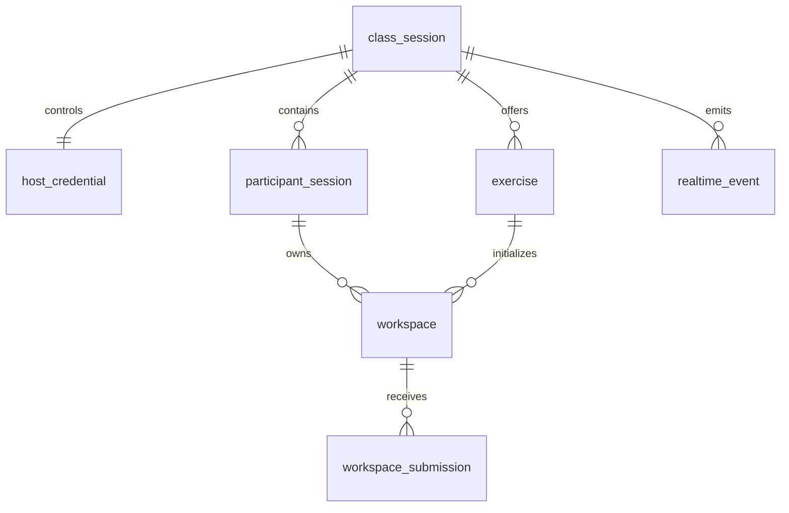

# Data Model & Dictionary

> **Project:** NetLab | **Document ID:** DOC-ERD-001 | **Version:** 0.1.0 | **Status:** Draft
> **Owner:** Data/Architecture | **Depends On:** `SRS.md`, P0 PRDs

## Entities

## Dictionary

| Entity | Purpose | PII/Sensitivity | Retention |
|---|---|---|---|
| `class_session` | Temporary classroom lifecycle | Internal | Until close + retention |
| `host_credential` | Hashed/opaque host authority | Restricted | Session lifetime |
| `participant_session` | Nickname and participant state | Personal/session data | Session lifetime |
| `exercise` | Question definition and targets | Public/internal content | Session or catalog policy |
| `workspace` | Topology/config snapshot | Student work | Session/local export policy |
| `workspace_submission` | Evaluation result and snapshot reference | Student work | Session + teacher export |
| `realtime_event` | Ordered session event metadata | Internal; no raw secrets | Short operational retention |

## Logical Fields

- `class_session`: `id` UUID PK, `class_code_hash` unique, `status` enum, `host_token_hash`, `expires_at`, `closed_at`, `created_at`, `updated_at`.
- `host_credential`: `id` UUID PK, `session_id` FK unique, `credential_hash`, `last_seen_at`, `expires_at`, `revoked_at`.
- `participant_session`: `id` UUID PK, `session_id` FK, `nickname` nullable/text (personal data), `join_token_hash`, `status`, `last_seen_at`, `joined_at`, `left_at`; index `(session_id,status)`.
- `exercise`: `id` UUID PK, `session_id` FK nullable, `schema_version`, `title`, `instructions`, `definition_json`, `status`, `created_at`.
- `workspace`: `id` UUID PK, `participant_id` FK, `exercise_id` FK, `schema_version`, `state_json`, `version` integer, `updated_at`; unique `(participant_id,exercise_id)`.
- `workspace_submission`: `id` UUID PK, `workspace_id` FK, `submission_key` unique, `workspace_version`, `result_json`, `status`, `score`, `submitted_at`.
- `realtime_event`: `id` UUID PK, `session_id` FK, `sequence` bigint, `event_type`, `actor_type`, `payload_json`, `created_at`; unique `(session_id,sequence)`.

## Constraints

- Tokens are never stored plaintext; only hashes/opaque provider references.
- `state_json` and `definition_json` pass schema validation and size limits before persistence.
- No email, phone, student number, or unnecessary identity field in P0.
- Timestamps stored UTC.
- Closed sessions reject new mutations.
- Workspace mutation uses optimistic version check.

## Status Enums

- `class_session.status`: `active`, `host_disconnected`, `closed`, `expired`.
- `participant_session.status`: `waiting`, `working`, `submitted`, `disconnected`, `removed`.
- `exercise.status`: `draft`, `ready`, `active`, `locked`, `closed`.
- `workspace_submission.status`: `submitted`, `evaluated`, `rejected`.
